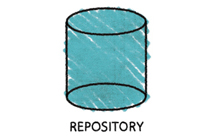
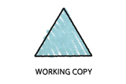
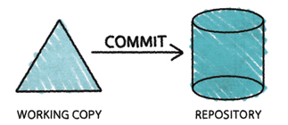
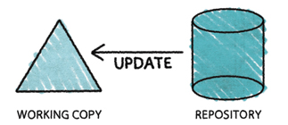

%Version Control
%José Manuel Calderón Trilla
%Oct, 2013

Introduction
============

Main Idea
---------

When working on a project, you want to be able to keep track of changes. This is
true for several reasons:

1. Finding bugs becomes easier
2. Collaboration is encouraged
3. Finding the most up-to-date version becomes trivial
    + Additionally, version controls can perform the role of backing up your work (if used properly!).

Types of Version Control
------------------------

There are many different types of version control. Luckily, they can all be
organised into one of two philosophies.

* Centralised
* Decentralised
    + We will look at a version control system from each of those categories and explain their motivation.

Take Away
---------

More than being a tutorial on how to *use* version control, this lecture is
aimed at convincing you that version control is a *good thing*\texttrademark.

Motivation for VCS
==================

Pre-History
-----------

* None
* Filename+version:
    "project_v1.py", "mycode20131012.java"
* Edit scripts using diff utility

A History
---------

* Source Code Control System (SCCS)
* Revision Control System (RCS)

Modern Era
----------

Huge number of choices with many different approaches: SVN, Git, BitKeeper,
Darcs, Bazaar, Mercurial, GHU arch and many many more.

Approaches to VCSs
==================

Some Terminology
----------------

1. Repository (repo): Where files and historical data are stored.

Some Terminology
----------------

2. Clone: A copy of a repository

Some Terminology
----------------

3. Branches: When a project is branched or forked two copies of those files may
develop independently of each other.

Some Terminology
----------------

4. Commit (verb): To store a set of changes to a repository.
4. Commit (noun): A specific revision of a repository.

Some Terminology
----------------

5. Conflict: When two changes are made to the same part of a project and cannot
be resolved automatically.

Some Terminology
----------------

6. Merge: Combine two sets of changes.

Two Philosophies
----------------

1. Centralised
    * There is a canonical repository
    * In order to commit a change, you must have access to the central repo
2. Distributed
    * Each clone (copy) is equally valid
    * Commits happen on local repo

Apache Subversion
=================

Basics
------

* Subversion (svn) is a popular *centralised* VCS 
* All of the departmental computers have svn installed.
* Version numbers grow sequentially; revision 15 is newer than revision 14

Basics 2
--------

Basics 2
--------

Basics 2
--------

Basics 2
--------

Pros
------

* Works as you would expect
* There is never question about what code your changes must be based on
* Lots and lots of documentation, books, and online resources

Cons
------

* Encourages large commits
* Branching is discouraged
* If the server goes down...

Git
=================

Pros
-----

* Encourages small commits
* Is being used increasingly
* Encourages branching!
* No single point of failure

Cons
-----

* Can be difficult
* Requires that everyone on the team knows how to use it well
